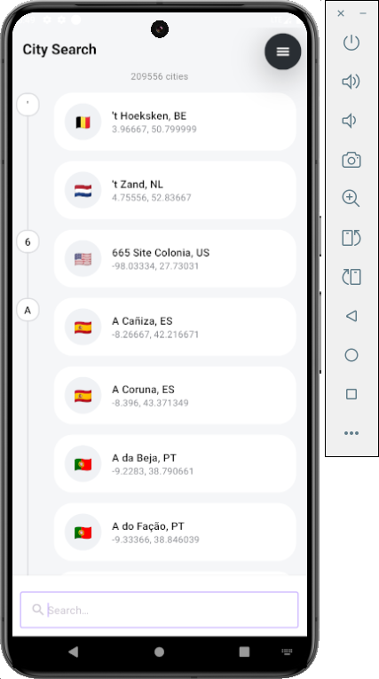
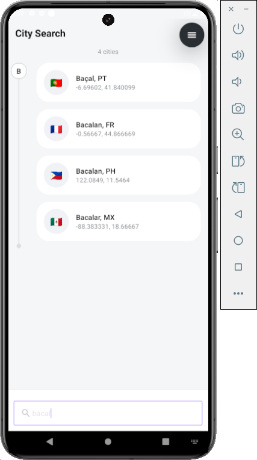

# CityFinder
Fast, lightweight city name search.
Built with Kotlin, Jetpack Compose, and a cacheable prefix index for O(log n) lookups and instant typing feedback.

## ✨ Features
- Instant city search with prefix lower/upper-bound binary search.
- Diacritics/whitespace-insensitive matching via normalization.
- In-memory index cache to avoid rebuilding on every query.
- Jetpack Compose UI: simple, modern search experience.
- Clean Architecture friendly: domain/use cases decoupled from UI & data

## 🛠 Tech Stack
- Language: Kotlin.
- UI: Jetpack Compose.
- DI: Hilt.

## 🧠 How Search Works (High-Level)
- Load cities from the repository (CityFinderIRepo).
- Normalize each city name (trim, Unicode NFD, strip diacritics, lowercase).
- Build a parallel keys array sorted alongside the original cities (CityIndexBuilder).
- Prefix query → [s, e) range using lower/upper-bound binary search over the keys array.
- Return a view of cities range (no copying cost), with results rendered in Compose.

## ⏱️ Performance & Complexity — First Build vs. Query
**Idea in one line:**  
We pay a one-time cost to build a sorted, normalized keys aligned with cities. After that, each search is just two binary searches to get a range and direct O(1) mapping from keys → cities.

#### 1) First time (index build)

**Work done**
- Normalize every city name: `O(n · L)` *(n = city count, L = avg name length)*
- Sort the normalized keys (and align `cities[]` accordingly): `O(n log n)`
- Build aligned arrays (`keys[i]` ↔ `cities[i]`): `O(n)`

**Total time (one-off):** `O(n · L + n log n)`

**Memory footprint**
- `cities[]`: original models (already needed by the app).
- `keys[]`: an additional array of length *n* with normalized strings.  
  Roughly: `keys[]` stores **one extra string per city**.  

**Why cache?**  
Because the build is the expensive part and your dataset is stable. Caching avoids paying `O(n · L + n log n)` again during the session.

#### 2) After that (each query/keystroke)

**Time per search**
- `lowerBound(q)` + `upperBound(q)` on `keys[]`: `O(log n)`
- Results are a half-open range `[start, end]` showing the first *k* items costs `O(k)` to render in UI.
- **Net per query:** `O(log n + k)` *(Where K is number of results)*

**Memory per search**
- No new structures; you just take a view (`s until e`) on existing arrays. No copying.

#### 3) Accessing a specific object

**From a search result**  
Index *i* in `[start, end]` maps directly: `val city = cities[i]` → **O(1)**.

# Screenshots: 

